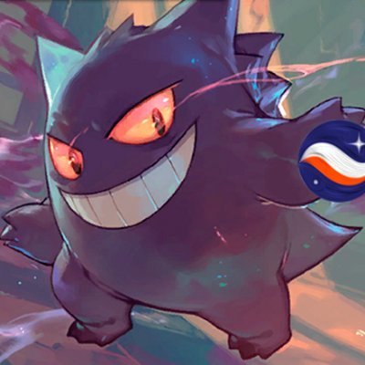
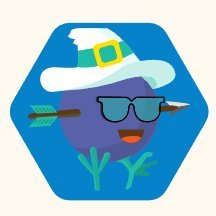
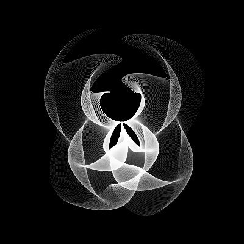
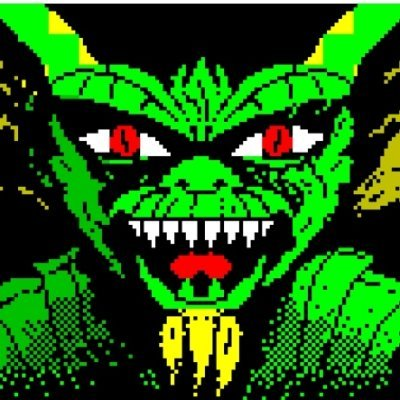

  
  <h1 align="center">Proyectos de la comunidad</h1>
  

  
En este repositorio añadiremos desde StarkNetEs Oficial una lista de recursos, dapps y contenidos creados por la comunidad StrakNetES relacionado con Starknet y Cairo.

### Autores y aportaciones

- [@dpinones](#dpinones)
- [@dub_zn](#dub_zn)
- [@Nadai02010](#nadai02010)
- [@haycarlitos](haycarlitos)
- [@devnet0x](#devnet0x)
- [@0xhasher_](#0xhasher_)

#### @dpinones

- [Pathfinders-AR](https://github.com/dpinones/pathfinders-ar) - Este proyecto fue desarrollado para el MatchBoxDAO Hackathon, la idea es desarrollar en Cairo un algoritmo que resuelva el problema de búsqueda de rutas para un mapa representado en 2D. El mapa puede contener obstáculos, además suponemos que el movimiento en las casillas es bidireccional con un coste de movimiento uniforme.
- [Deploying a contract on StarkNet Testnet2(Goerli 2) using Protostar](https://medium.com/@dpinoness/deploying-a-contract-on-starknet-testnet2-goerli-2-using-protostar-bb477b2154a3) - En este tutorial, implementaremos un contrato en Tesnet2 utilizando Protostar de SwMansion.
- [Exploring of cairo 1](https://github.com/dpinones/exploring-of-cairo-1) -Primeras exploraciones de [@dpinones](https://github.com/dpinones) enseñando Cairo 1.0.

#### @dub_zn

- [Pokecairo](https://github.com/sdgalvan/pokemon-cards-cairo) - Es una colección de NFT en Cairo (sin valor real) basada en el primer paquete de los juegos originales de Pokémon. Esto NO está destinado a ningún tipo de beneficio monetario, es simplemente por diversión y para aprender más sobre el ecosistema Blockchain/Starknet. 
- [Pathfinders-AR](https://github.com/dpinones/pathfinders-ar) - Este proyecto fue desarrollado para el MatchBoxDAO Hackathon, la idea es desarrollar en Cairo un algoritmo que resuelva el problema de búsqueda de rutas para un mapa representado en 2D. El mapa puede contener obstáculos, además suponemos que el movimiento en las casillas es bidireccional con un coste de movimiento uniforme.
- [Cairo 1.0 Installer](https://github.com/sdgalvan/cairo-installer) -  Guía de instalación de [@dub](https://github.com/sdgalvan) que instala una versión de Cairo 1.0.
- [Deployando un contrato en Testnet 2 de StarkNet](https://medium.com/starknet-en-espa%C3%B1ol/deployando-un-contrato-en-testnet-2-de-starknet-e2b101aef504) - Con este documento aprenderemos a usar la Testnet 2 para los desarrolladores.

#### @Nadai02010

- [Nadai L2 Español Profundizando Starks](https://mirror.xyz/layer2es.eth/8TUEfpZPgl1u3-HyyGaUA0YMrFm8XSHfYtY6tfqFX7s) - Nadai con L2 Español elaboraron un artículo profundizando sobre el ecosistema Starkware, Starknet y Starks, un documento que incluye Winterfell, RiscZero, ZeroSync, Polygon Miden y más, haciendo que las Starks siente las báses criptográficas del futuro.
- [Nadai Cairo 1.0](https://github.com/Nadai2010/Nadai-Cairo-1.0) - Explorando Cairo 1.0, nuevos conceptos, traducciones y sintáxis.
- [¿Qué son los SFTs (Semi Fungibles Tokens)?](https://github.com/Nadai2010/Nadai-ERC3525-Starknet) - Guía el ERC-3525 Semi-Fungible Token SFT, como deployar en Starknet y su finalidad.
- [¿Qué es SHARP?](https://github.com/Nadai2010/Nadai-SHARP-Starknet) - Explicación de SHARP y su objetivo en garantizar la seguridad y la verificabilidad de los contratos inteligentes escritos en Cairo, el lenguaje de programación de Starknet.
- [Nadai Starknet UDC con Protostar y L2EsERC72](https://github.com/Nadai2010/Nadai-Starknet-UDC-Protostar-L2ESERC721)
- [Workshop L2 Starknet AA](https://github.com/Nadai2010/Nadai-Workshop-L2-Starknet-AA) - Recapitulación de los Workshop 6-7 realizados por las comunidades de L2 Español y StarkNetEs sobre AA.
- [Nadai UDC con Protostar y NFT con Metadata de POAP](https://github.com/Nadai2010/Nadai-Starknet-UDC-Protostar-L2ESERC721) - En esta guía aprenderemos como deployar un contrato usando el Universal Deploy Contract, también podran disfurtar de una metadata EXCLUSIVA para el Mint de unos NFT de la colección de los POAP de L2 Español y StarkNetEs.

#### @haycarlitos

- [Cosecha](https://github.com/haycarlitos/cosecha-starknet) - Cocecha es una solucion que le permite a los pequeños y medianos productores de cannabis simlificar el proceso de obtención de licencias. Connectarse a los reguladores a través de una API para someter sus documentos a aprobacion y obtener Certificado de NFT creado en la red Starknet.

#### @devnet0x

- [StarkNet Security Challenge](https://github.com/devnet0x/Starknet-Security-Challenges-Repo) - Inspirado en Ethereum Capture the Ether, este es un juego en el que pirateas contratos inteligentes de Starknet para aprender sobre seguridad. Está destinado a ser tanto divertido como educativo. Este juego está siendo adaptado a la red Starknet por [@devnet0x](https://github.com/devnet0x)

#### @0xhasher_

- [¿En qué consiste el Protocolo FRI?](https://twitter.com/0xhasher_/status/1626245754116341760)
- [Matemáticas del Protocolo STARK](https://twitter.com/0xhasher_/status/1623006274962042891)
- [Introducción a los STARK](https://twitter.com/0xhasher_/status/1620100835823996933)
- [Amenazas de la computación cuántica](https://twitter.com/0xhasher_/status/1618259198177079296)
- [Diferencias entre algortimos iterativos y recursivos](https://twitter.com/0xhasher_/status/1616481652024147977)
- [Zero Knowledge Parte 1](https://twitter.com/0xhasher_/status/1590844232599732224)
- [Zero Knowledge Parte 2](https://twitter.com/0xhasher_/status/1593380196765286400)
- [Zero Knowledge Parte 3](https://twitter.com/0xhasher_/status/1595447526010015744)
- [Aritmética modular Parte 1](https://twitter.com/0xhasher_/status/1593380447643467778)
- [Aritmética modular Parte 2](https://twitter.com/0xhasher_/status/1560837639057596417)
- [Estructura Algebráicas](https://twitter.com/0xhasher_/status/1586142877796552704)

## Autores y agredecimentos ✨

<table>
  <tbody>
    <tr>
      <td align="center" valign="top" width="14.28%"><a href="https://twitter.com/dpinoness"> <b>@dpinoness</b></a> </td>
      <td align="center" valign="top" width="14.28%"><a href="https://twitter.com/dub_zn"> <b>@dub_zn</b></a> </td>
      <td align="center" valign="top" width="14.28%"><a href="https://twitter.com/Nadai02010"> <b>@Nadai02010</b></a> </td>
      <td align="center" valign="top" width="14.28%"><a href="https://twitter.com/haycarlitos"> <b>@haycarlitos</b></a> </td>
      <td align="center" valign="top" width="14.28%"><a href="https://twitter.com/devnet0x"> <b>@devnet0x</b></a> </td>
       <td align="center" valign="top" width="14.28%"><a href="https://twitter.com/0xhasher_"> <b>@0xhasher_</b></a> </td>
    </tr>
  </tbody>
</table>

